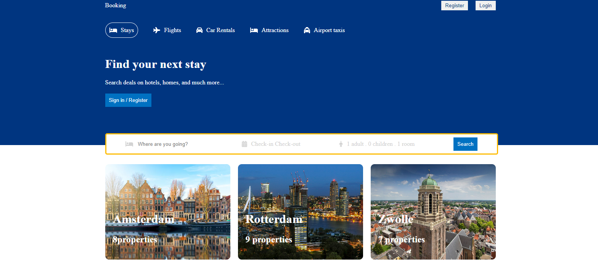
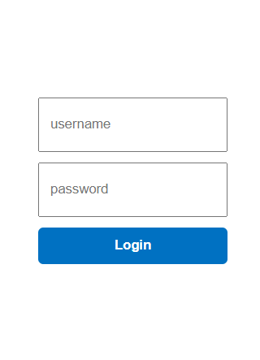
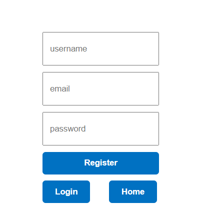
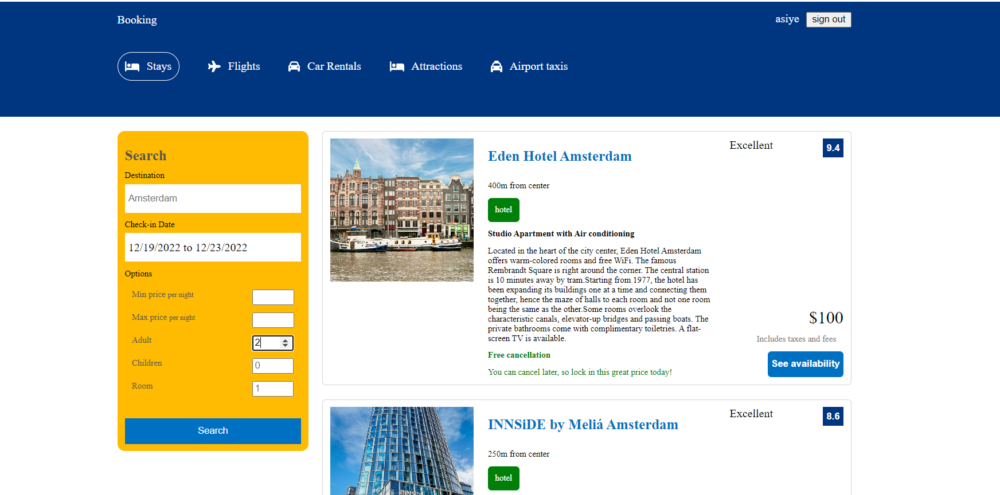
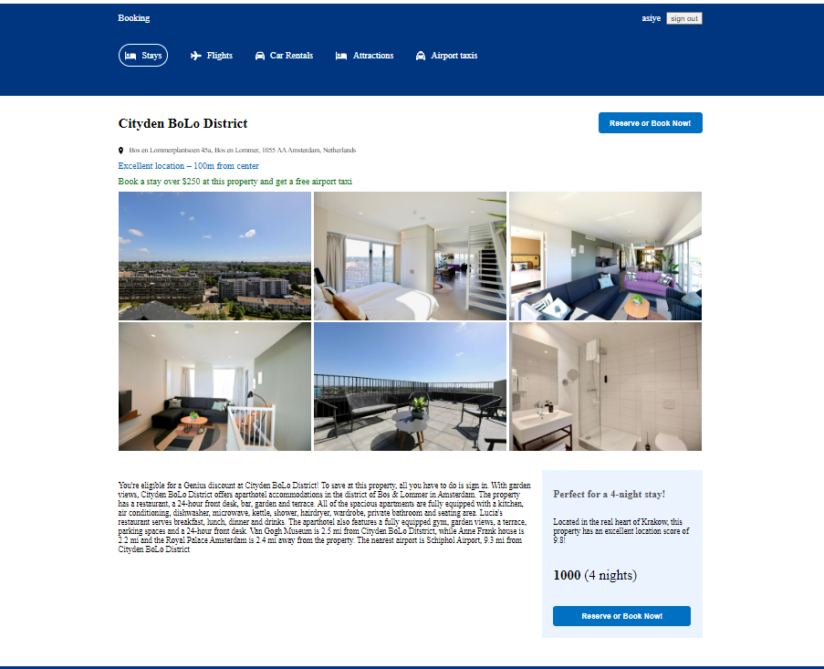
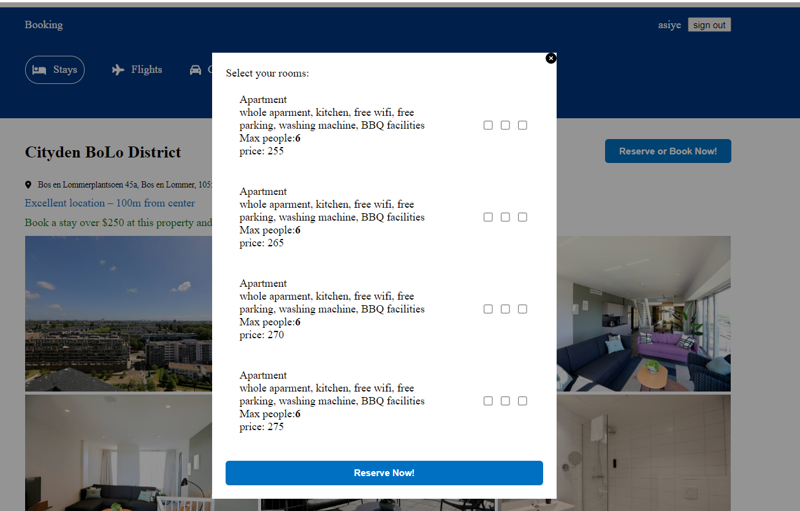

# Booking

---

## How does Booking be used?

- User can search homes,hotels,apartments,villas,resorts by writing city name from search engine with date range also can choose adult, children and room number
  
- User can register ,login and logout
  
  
  
- After search user can choose any hotel from search result
  
- if user click to one hotel user can see the detail of the hotel
  
- after clicking reserve button available rooms will pop out with their features, user can click ay room and reserve it
  

---
